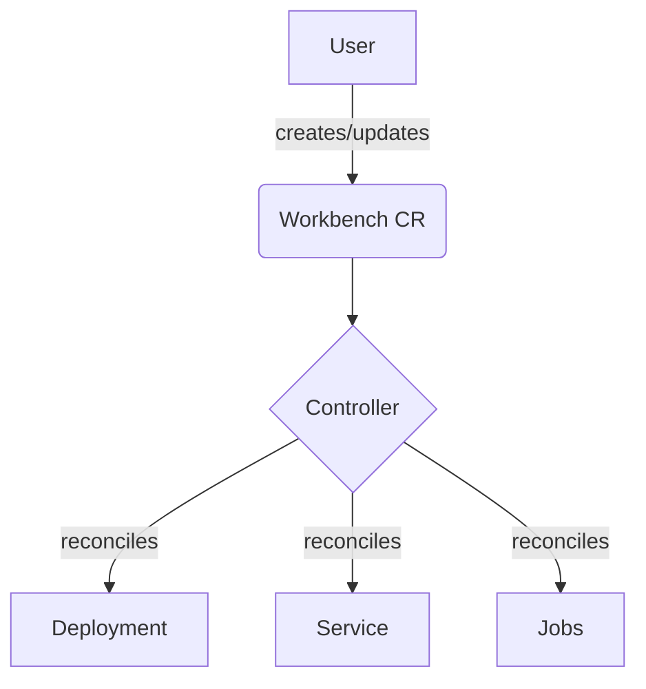

# System Patterns: workbench-operator

## Architecture
The `workbench-operator` follows the standard Kubernetes operator pattern. It introduces a `Workbench` Custom Resource Definition (CRD) and a controller that reconciles the state of `Workbench` objects in the cluster.

## Reconciliation Loop
The core logic of the operator resides in the `internal/controller/workbench_controller.go` file. The `Reconcile` function is triggered by changes to `Workbench` resources. It ensures that the corresponding `Deployment`, `Service`, and `Job` resources are in the desired state as defined in the `Workbench` spec.

## Resource Management
- **Deployment**: A single `Deployment` is created for each `Workbench` to run the Xpra server. This ensures that the server is always running.
- **Service**: A `Service` exposes the Xpra server on port 8080 for HTTP access.
- **Jobs**: Each application specified in the `Workbench` CR's `apps` map is run as a separate `Job`. This allows applications to be started and stopped independently. A unique identifier is used as the key for each application in the map.
- **Resource Requests and Limits**: The operator now sets default resource requests for application containers. Users can override these defaults by specifying their own requests and limits. If only requests are provided, they are also used as the limits.

## Workbench Configuration
- **Initial Resolution**: The `Workbench` CRD now supports specifying the initial display resolution for the Xpra server using `initialResolutionWidth` and `initialResolutionHeight` fields in the `server` spec. 